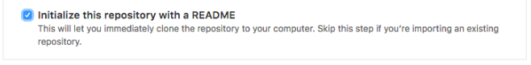
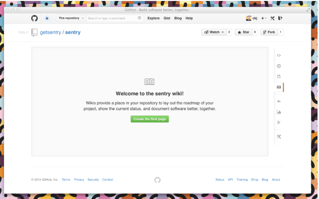
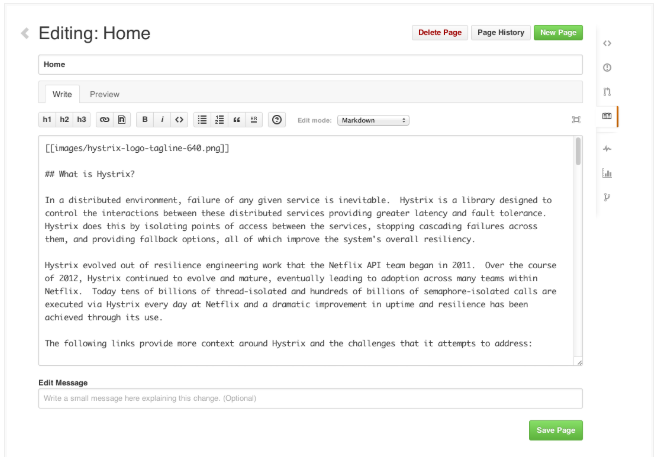
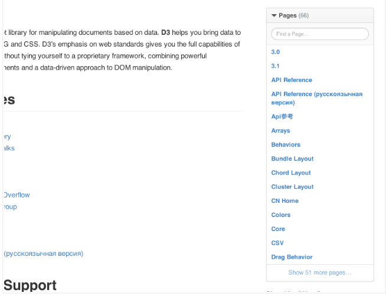

# Documenting your projects on github

Good documentation is key to the success of any project. Making documentation accessible enables people to learn about a project; making it easy to update ensures that documentation stays relevant.

Two common ways to document a project are README files and wikis:

README files are a quick and simple way for other users to learn more about your work.

Wikis on GitHub help you present in-depth information about your project in a useful way.

It’s a good idea to at least have a README on your project, because it’s the first thing many people will read when they first find your work.


 # **Create your README**

 When you create a new repository though GitHub, select “Initialize this repository with a README” unless you plan to import an existing repository.

 

 Your README.md file is now available for editing in your brand-new repository. Your project’s name is at the top, followed by any description you chose to include when creating the repository. READMEs are easy to modify, both on GitHub or locally. Check out the Mastering Markdown guide to learn more about how to modify the text within the file after you’ve made it.

 # **Formatting your README**

 READMEs generally follow one format in order to immediately orient developers to the most important aspects of your project.

 **. Project name:** Your project’s name is the first thing people will see upon scrolling down to your README, and is included upon creation of your README file.

**.Description:** A description of your project follows. A good description is clear, short, and to the point. Describe the importance of your project, and what it does.

**.Table of Contents:** Optionally, include a table of contents in order to allow other people to quickly navigate especially long or detailed READMEs.

**.Installation:** Installation is the next section in an effective README. Tell other users how to install your project locally. Optionally, include a gif to make the process even more clear for other people.

**.Usage:** The next section is usage, in which you instruct other people on how to use your project after they’ve installed it. This would also be a good place to include screenshots of your project in action.

**.Contributing:** Larger projects often have sections on contributing to their project, in which contribution instructions are outlined. Sometimes, this is a separate file. If you have specific contribution preferences, explain them so that other developers know how to best contribute to your work. To learn more about how to help others contribute, check out the guide for setting guidelines for repository contributors.

**.Credits:** Include a section for credits in order to highlight and link to the authors of your project.

**.License:** Finally, include a section for the license of your project. For more information on choosing a license, check out GitHub’s licensing guide!

Your README should contain only the necessary information for developers to get started using and contributing to your project. Longer documentation is best suited for wikis, outlined below.


# **Creating your wiki**

Every repository on GitHub comes with a wiki. After you’ve created a repository, you can set up the included wiki through the sidebar navigation. Starting your wiki is simply a matter of clicking the wiki button and creating your first page.



# **Adding content**

Wiki content is designed to be easily editable. You can add or change content on any wiki page by clicking the **Edit** button located in the upper right corner of each page. This opens up the wiki editor.



Wiki pages can be written in any format supported by [ GitHub Markup](https://guides.github.com). Using the drop-down menu in the editor, you can select the format of your wiki, and then use wiki toolbar to create and include content on a page. Wikis also give you the option of including a custom footer where you can list things like contact details or license information for your project.

GitHub keeps track of changes made to each page in your wiki. Below a page title, you can see who made the most recent edits, in addition to the number of commits made to the page. Clicking on this information will take you to the full page history where you can compare revisions or see a detailed list of edits over time.


# **Adding pages**

You can add additional pages to your wiki by selecting **New Page** in the upper right corner. By default, each page you create is included automatically in your wiki’s sidebar and listed in alphabetical order.



You can also add a custom sidebar to your wiki by clicking the Add custom sidebar link. Custom sidebar content can include text, images, and links.

Note: The page called “Home” functions as the entrance page to your wiki. If it is missing, an automatically generated table of contents will be shown instead.

> **If you're knowledgable with the command line, you can also modify wikis locally. Check out [our help article](https://help.github.com/articles/adding-and-editing-wiki-pages-locally/) for more info.**

# *Syntax highlighting*

Wiki pages support automatic syntax highlighting of code for a wide range of languages by using the following syntax:

```ruby
  def foo
    puts 'bar'
  end
```

The block must start with three backticks, optionally followed by the the name of the language that is contained by the block. See Pygments for the list of languages that can be syntax highlighted.

The block contents should be indented at the same level as the opening backticks. The block must end with three backticks indented at the same level as the opening backticks.

# **You’re done!**

You have learned some important information about how to best share your work with the rest of the GitHub community, whether your project is large enough in scope for its own wiki or you’re just starting out and setting up a clear and concise README.

To read more on the topics covered in this article, our guides for [creating a new repository](https://help.github.com/articles/creating-a-new-repository/), [editing files in your repository](https://help.github.com/articles/editing-files-in-your-repository/), [setting guidelines for repository](https://help.github.com/articles/setting-guidelines-for-repository-contributors/)  and [choosing a license](https://choosealicense.com/) are great places to start. Otherwise, check out some other GitHub Guides to keep learning.

Finally, if you’re interested in building a documentation site for your project, we recommend using [GitHub Pages](https://pages.github.com/).
